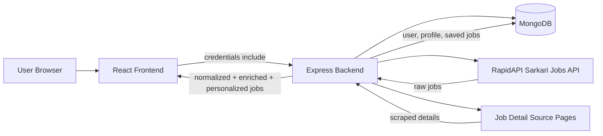
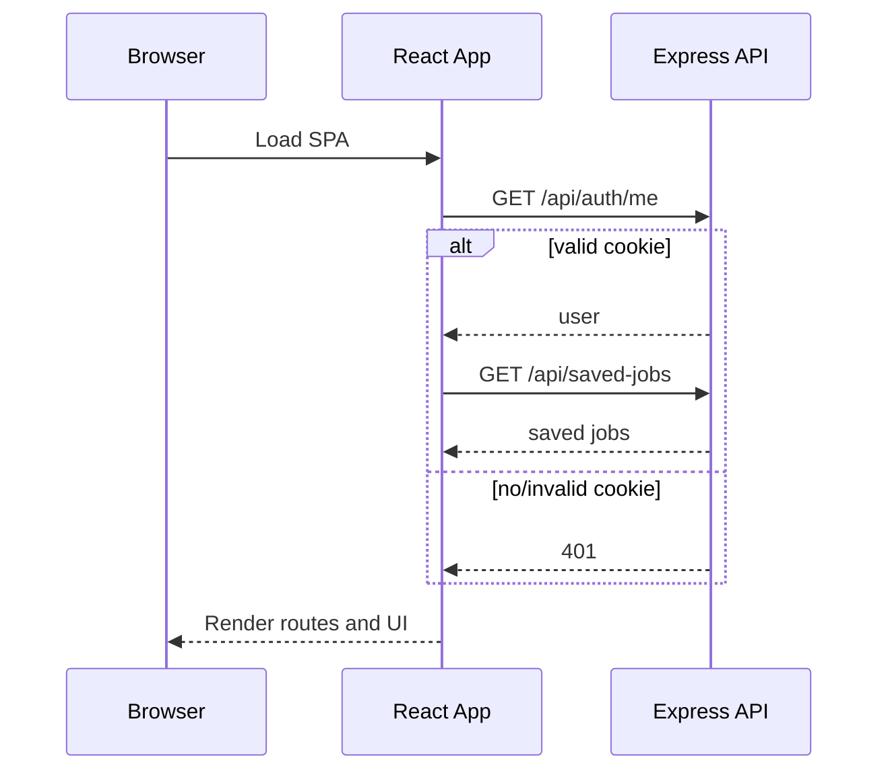
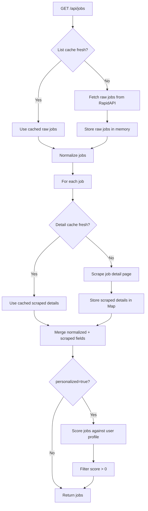
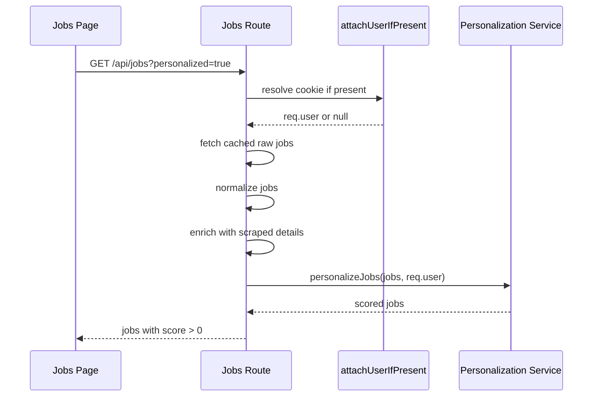
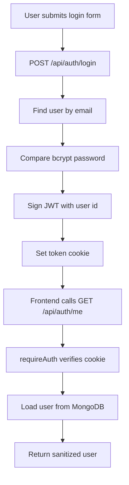
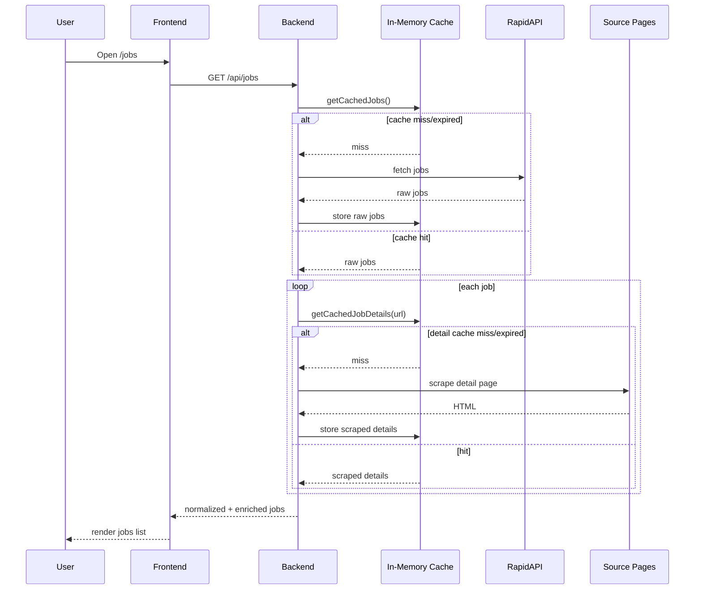

# GovJob Finder Architecture

## 1. Overview

GovJob Finder is a full-stack web application for discovering government jobs, creating a user profile, viewing personalized matches, and saving jobs for later. The codebase is split into:

- `frontend/`: React + Vite single-page application
- `backend/`: Express API server with MongoDB persistence

At a high level:

- The frontend renders the landing page, jobs page, and saved jobs page.
- The backend handles authentication, profile persistence, saved jobs persistence, job aggregation, job-detail enrichment, and personalization.
- Jobs originate from an external RapidAPI endpoint and are enriched by scraping each job detail page.
- Authentication is session-like, but implemented with a JWT stored in an HTTP-only cookie.
- Caching is implemented in backend memory, not in Redis, MongoDB, or any external cache.

This document describes the system as currently implemented in the repository.

## 2. System Scope

### Implemented

- User signup and login
- Cookie-based authenticated session restoration
- User profile create/update
- Latest jobs listing
- Personalized jobs listing
- Save/unsave jobs
- External jobs ingestion from RapidAPI
- Per-job detail enrichment by scraping source pages
- In-memory caching for job lists and job details

### Present in UI but only partially implemented

- Resume upload
- Resume-based personalization
- Pricing / plans
- Alerts / notifications
- Advanced eligibility analysis

The resume flow is currently simulated on the frontend using `localStorage`; there is no backend upload pipeline.

## 3. High-Level Architecture



## 4. HLD

### 4.1 Major Building Blocks

| Layer | Module | Responsibility |
| --- | --- | --- |
| Presentation | React SPA | Pages, modals, user interactions, route protection in UI |
| API | Express server | Auth, jobs API, saved jobs API, profile API |
| Persistence | MongoDB via Mongoose | Users, embedded profile, embedded saved jobs |
| Integration | RapidAPI + source websites | Raw job feed and detail-page enrichment |
| Cache | In-process memory | Reduce repeated list fetches and repeated scraping |
| Personalization | Rule-based scorer | Score jobs from user profile fields |

### 4.2 Architectural Style

- Frontend: client-rendered SPA
- Backend: monolithic Express API
- Database model: single main aggregate around `User`
- Integration style: backend-for-frontend plus third-party aggregation
- Caching style: local process memory cache

## 5. Repository Structure

```text
govjobfinder/
├─ frontend/
│  ├─ src/
│  │  ├─ components/
│  │  ├─ pages/
│  │  ├─ utils/
│  │  └─ assets/
│  ├─ public/
│  ├─ package.json
│  └─ vite.config.js
├─ backend/
│  ├─ config/
│  ├─ middleware/
│  ├─ models/
│  ├─ routes/
│  ├─ services/
│  ├─ utils/
│  ├─ app.js
│  └─ package.json
├─ project-documentation.html
└─ architecture.md
```

## 6. Technology Stack

### Frontend

- React 19
- React Router DOM 7
- Vite 7
- Tailwind CSS 4
- Framer Motion
- Lenis
- Lucide React

### Backend

- Node.js
- Express 5
- Mongoose
- JWT (`jsonwebtoken`)
- `bcryptjs`
- `axios`
- `cors`
- `cookie-parser`
- `dotenv`

## 7. Frontend Architecture

## 7.1 Entry and Bootstrapping

- `frontend/src/main.jsx`
  - Wraps the app in `BrowserRouter`
  - Mounts `App`

- `frontend/src/App.jsx`
  - Owns top-level `user` state
  - Owns top-level `savedJobs` state
  - Restores session via `GET /api/auth/me`
  - Loads saved jobs after authentication
  - Protects `/jobs` and `/saved-jobs` by redirecting unauthenticated users to `/`

## 7.2 Route Map

| Route | Page | Access | Notes |
| --- | --- | --- | --- |
| `/` | `Home` | Public | Landing page plus onboarding entry points |
| `/jobs` | `Jobs` | Frontend-protected | All jobs or personalized jobs |
| `/saved-jobs` | `SavedJobs` | Frontend-protected | Saved jobs only |

### Query Parameters

| Route | Query | Meaning |
| --- | --- | --- |
| `/jobs` | `personalized=true` | Request backend-personalized jobs |

## 7.3 Shared Frontend State

Top-level state in `App.jsx`:

- `user`
  - `null` when not authenticated
  - populated from `/api/auth/me` when authenticated
- `savedJobs`
  - loaded from `/api/saved-jobs`
  - updated after save/unsave actions

This means authentication and saved jobs are managed client-side in React state, but backed by server APIs and persisted on the backend.

## 7.4 Frontend Modules

### Core pages

- `Home.jsx`
  - Renders marketing sections and CTA
  - Opens profile creation and resume upload modals

- `Jobs.jsx`
  - Fetches `/api/jobs` or `/api/jobs?personalized=true`
  - Shows personalization scores and reasons in personalized mode
  - Uses the heart toggle to save or unsave jobs

- `SavedJobs.jsx`
  - Displays saved jobs from top-level state
  - Uses same toggle callback to unsave

### Core components

- `Navbar.jsx`
  - Sign in button when logged out
  - User menu when logged in
  - Logout flow
  - Link to saved jobs

- `LoginModal.jsx`
  - Combined signup/login modal
  - Signup calls `POST /api/auth/signup`
  - Login calls `POST /api/auth/login`
  - Then calls `GET /api/auth/me`

- `CreateProfileForm.jsx`
  - Create/update profile modal
  - Sends `PUT /api/auth/profile`

- `GetStartedModal.jsx`
  - Wrapper modal for profile and resume actions

- `UploadResumeModal.jsx`
  - Simulates upload only
  - Stores file metadata in `localStorage.userResume`

- `CTA.jsx`
  - Checks:
    - backend-persisted `user.profile`
    - local-only `localStorage.userResume`
  - Chooses which onboarding step to open

### Utility modules

- `src/utils/api.js`
  - Builds API URLs from `VITE_API_URL`
  - Defaults to `http://localhost:5000`

- `src/utils/savedJobs.js`
  - Encapsulates saved-jobs API calls
  - Defines job identity helper:
    - primary key: `applyLink`
    - fallback key: `title-lastDate`

## 7.5 Frontend Rendering Flow



## 8. Backend Architecture

## 8.1 Server Bootstrap

`backend/app.js`:

- loads environment variables
- connects to MongoDB on startup
- configures JSON parsing
- configures URL-encoded body parsing
- configures cookie parsing
- configures credentialed CORS with allowlist
- mounts route groups:
  - `/api/auth`
  - `/api/jobs`
  - `/api/saved-jobs`

## 8.2 Route Modules

### `routes/auth.js`

Responsibilities:

- signup
- login
- logout
- current user lookup
- profile update

### `routes/jobs.js`

Responsibilities:

- fetch cached raw jobs
- normalize raw jobs
- scrape details per job with per-job cache
- optionally personalize based on logged-in user

### `routes/savedJobs.js`

Responsibilities:

- return saved jobs for current user
- add saved job
- remove saved job

## 8.3 Middleware

### `requireAuth`

- reads `req.cookies.token`
- verifies JWT using `JWT_SECRET`
- loads the user from MongoDB
- attaches user document to `req.user`
- rejects with `401` if invalid or absent

### `attachUserIfPresent`

- same token resolution pattern as `requireAuth`
- does not reject anonymous requests
- sets `req.user` to `null` when token is missing/invalid

This allows `/api/jobs` to work for both anonymous and authenticated users, while only enabling personalization when a valid user is attached.

## 8.4 Data Model

The application currently has one main persistent model: `User`.

### `User` schema

| Field | Type | Notes |
| --- | --- | --- |
| `name` | String | required |
| `email` | String | required, unique |
| `password` | String | required, bcrypt-hashed |
| `profile` | Embedded object or `null` | optional |
| `savedJobs` | Embedded array | user-specific saved jobs |
| `createdAt` | Date | via timestamps |
| `updatedAt` | Date | via timestamps |

### `profile` subdocument

| Field | Type |
| --- | --- |
| `age` | Number |
| `gender` | String |
| `qualification` | String |
| `category` | String |
| `state` | String |
| `phone` | String |

### `savedJobs` subdocument

| Field | Type | Notes |
| --- | --- | --- |
| `title` | String | required |
| `lastDate` | String | defaults to `Not specified` |
| `applyLink` | String | required |
| `savedAt` | Date | defaults to now |

## 9. API Contract

## 9.1 Auth APIs

| Method | Path | Auth | Purpose |
| --- | --- | --- | --- |
| `POST` | `/api/auth/signup` | No | Create account |
| `POST` | `/api/auth/login` | No | Login and set cookie |
| `POST` | `/api/auth/logout` | No | Clear cookie |
| `GET` | `/api/auth/me` | Yes | Return current user |
| `PUT` | `/api/auth/profile` | Yes | Create/update profile |

### Signup flow

1. Check if `email` already exists.
2. Hash password with bcrypt.
3. Create user document.
4. Return success message.

### Login flow

1. Find user by email.
2. Compare password with bcrypt.
3. Sign JWT with `{ id: user._id }`.
4. Set `token` cookie.
5. Return login success with lightweight user info.

### Cookie configuration

- Development:
  - `httpOnly: true`
  - `secure: false`
  - `sameSite: "lax"`
- Production:
  - `httpOnly: true`
  - `secure: true`
  - `sameSite: "none"`

Token max age is 7 days.

## 9.2 Jobs API

| Method | Path | Auth | Purpose |
| --- | --- | --- | --- |
| `GET` | `/api/jobs` | Optional | Return all enriched jobs |

### Query flags

| Query | Behavior |
| --- | --- |
| `personalized=true` | Score and filter jobs using attached user profile |

## 9.3 Saved Jobs API

| Method | Path | Auth | Purpose |
| --- | --- | --- | --- |
| `GET` | `/api/saved-jobs` | Yes | Return saved jobs |
| `POST` | `/api/saved-jobs` | Yes | Save job |
| `DELETE` | `/api/saved-jobs` | Yes | Remove saved job |

## 10. Job Ingestion Pipeline

## 10.1 Source of Jobs

Jobs come from:

- RapidAPI endpoint: `https://sarkari-result.p.rapidapi.com/jobs/`

The backend service `services/externalJobsApi.js` calls this endpoint using:

- `RAPIDAPI_KEY`
- `RAPIDAPI_HOST`

## 10.2 Raw Job Shape

The backend expects the external API response to contain:

- `data` as an array of job objects

From each raw job, it uses:

- `title`
- `last_date`
- `link`

## 10.3 Normalization

`utils/normalizeJobs.js` converts raw jobs into the internal base shape:

```js
{
  title,
  lastDate,
  applyLink
}
```

Normalization benefits:

- shields the frontend from third-party schema changes
- standardizes missing values
- keeps a minimal internal job contract

## 10.4 Detail Enrichment

After normalization, the backend enriches each job by scraping the job detail page from `job.applyLink`.

`services/jobDetailsScraper.js` extracts:

- `title`
- `organization`
- `postDate`
- `shortInformation`
- `importantDates`
- `applicationFee`
- `ageLimit`
- `totalVacancies`
- `qualification`
- `officialWebsite`
- `notificationLink`
- `applyOnlineLink`
- `tags`
- `scrapedAt`

It also:

- strips HTML
- decodes common HTML entities
- parses sections by heading names
- extracts links by label matching
- infers organization from known patterns
- generates tags from textual heuristics

## 10.5 Final Job Object Returned to Frontend

The backend merges normalized data and scraped data. The final returned job can contain:

| Field | Source |
| --- | --- |
| `title` | scraped title preferred, normalized fallback |
| `lastDate` | normalized |
| `applyLink` | scraped apply link preferred, normalized fallback |
| `sourceLink` | original normalized apply link |
| `organization` | scraped |
| `postDate` | scraped |
| `shortInformation` | scraped |
| `importantDates` | scraped |
| `applicationFee` | scraped |
| `ageLimit` | scraped |
| `totalVacancies` | scraped |
| `qualification` | scraped |
| `officialWebsite` | scraped |
| `notificationLink` | scraped |
| `tags` | scraped/derived |
| `scrapedAt` | scraped |
| `personalizationScore` | added only during personalization |
| `personalizationReasons` | added only during personalization |

If scraping fails, the backend still returns the normalized job with empty enrichment fields.

## 11. Caching Architecture

## 11.1 What Is Cached

There are two caches in `backend/services/cache.js`:

1. Jobs list cache
2. Per-job detail cache

## 11.2 Jobs List Cache

Implementation:

- variables:
  - `cachedJobs`
  - `lastFetchTime`
- TTL:
  - `60 * 60 * 1000` = 1 hour

Behavior:

1. `/api/jobs` calls `getCachedJobs(fetchExternalJobs)`.
2. If cached data exists and is younger than 1 hour, backend returns cached raw jobs.
3. Otherwise backend fetches fresh raw jobs from RapidAPI.
4. Cache is replaced in memory.

## 11.3 Job Detail Cache

Implementation:

- `jobDetailsCache = new Map()`
- key:
  - job URL, passed as `cacheKey`
- value:
  - `{ data, timestamp }`
- TTL:
  - `6 * 60 * 60 * 1000` = 6 hours

Behavior:

1. For each job, `/api/jobs` calls `getCachedJobDetails(job.applyLink, fetchFn)`.
2. If URL-specific detail data is fresh, return cached details.
3. Otherwise scrape the page and store the result in the map.

## 11.4 Important Cache Characteristics

- Cache is in-process only.
- Cache is not shared between multiple backend instances.
- Cache is lost on backend restart or redeploy.
- Cache has no eviction strategy beyond TTL.
- Cache can grow with the number of unique scraped job URLs.
- There is no warming/preload step.

## 11.5 Cache Flow Diagram



## 12. Personalization Architecture

## 12.1 Trigger

Personalization is activated when:

- frontend requests `/api/jobs?personalized=true`

and

- backend is able to attach an authenticated user with a saved profile

## 12.2 Profile Inputs Used

Current personalization uses:

- `user.profile.qualification`
- `user.profile.state`
- `user.profile.category`

It does not currently use:

- age
- gender
- phone
- uploaded resume contents
- skills extraction
- saved jobs history

## 12.3 Scoring Logic

`services/personalization.js` is a rule-based scorer.

### Qualification matching

- profile qualification is normalized
- derived tokens are added for known education families
- examples:
  - engineering -> `engineering`, `b.tech`, `be`, `diploma`
  - graduate -> `graduate`, `degree`, `bachelor`
  - 12th -> `12th`, `intermediate`, `senior secondary`
  - 10th -> `10th`, `matric`

If any qualification token appears in the job’s searchable text:

- `+5` score
- reason: `Matches your qualification`

### State matching

If profile state appears in the job text:

- `+3` score
- reason: `Mentions your preferred state`

### Category matching

If profile category appears in the job text:

- `+2` score
- reason: `Mentions your category`

### Tag bonus

If the job has at least one derived tag:

- `+1` score

### Sorting

Jobs are sorted by:

1. higher `personalizationScore`
2. alphabetical `title`

### Filtering in personalized mode

`/api/jobs?personalized=true` returns only jobs where:

- `personalizationScore > 0`

## 12.4 Personalization Flow



## 13. Authentication and Session Flow

## 13.1 Backend Auth Design

- Stateless JWT
- Transported in an HTTP-only cookie
- User object loaded from DB on each protected request

This is not server-side session storage; identity is reconstructed per request from the signed token.

## 13.2 Request Flow



## 13.3 Frontend Session Restoration

On first app load:

1. `App.jsx` calls `/api/auth/me`
2. If valid, it stores the returned user in state
3. It then loads `/api/saved-jobs`
4. Protected routes become accessible

## 13.4 Logout

1. Frontend calls `POST /api/auth/logout`
2. Backend clears the `token` cookie
3. Frontend clears local `user`
4. Frontend navigates back to `/`

## 14. Saved Jobs Architecture

Saved jobs are embedded within the `User` document, not stored in a separate collection.

### Save identity

Job identity is based on:

- primary: `applyLink`
- fallback: `title-lastDate`

### Save flow

1. User clicks heart icon.
2. Frontend checks whether that job already exists in current state.
3. If absent, frontend `POST`s the job to `/api/saved-jobs`.
4. Backend deduplicates and prepends the entry.
5. Backend persists the updated user document.
6. Backend returns full saved jobs array.
7. Frontend replaces local `savedJobs` state.

### Remove flow

1. User clicks heart on a saved job.
2. Frontend sends `DELETE /api/saved-jobs` with job payload.
3. Backend filters matching entry out of `req.user.savedJobs`.
4. Updated document is saved and returned.

### Tradeoffs of embedded saved jobs

Pros:

- simple schema
- easy per-user fetch
- no joins needed

Cons:

- saved jobs cannot be queried globally
- user document can grow over time
- duplicate job metadata is stored per user

## 15. LLD by Module

## 15.1 Backend LLD

### `config/db.js`

- establishes Mongoose connection using `MONGO_URI`
- exits process on connection failure

### `middleware/auth.js`

- shared token resolution logic
- strict and optional auth variants

### `services/externalJobsApi.js`

- single responsibility: fetch raw jobs from RapidAPI

### `services/cache.js`

- generic cache wrapper for full job list
- generic cache wrapper for per-job detail data

### `services/jobDetailsScraper.js`

- fetches HTML from source page
- strips markup
- parses sections by heading names
- extracts links
- infers tags and organization

### `services/personalization.js`

- normalizes text
- expands qualification tokens
- computes per-job score and reasons
- sorts ranked results

### `utils/normalizeJobs.js`

- validates `apiResponse.data` is an array
- maps third-party fields into app fields

## 15.2 Frontend LLD

### `App.jsx`

- session bootstrap
- saved jobs bootstrap
- route protection
- toggle save orchestration

### `Jobs.jsx`

- reads query param via `useSearchParams`
- fetches personalized or non-personalized jobs
- renders score badges and match reasons

### `LoginModal.jsx`

- switches between signup and login modes
- after successful login, follows with `/api/auth/me`

### `CreateProfileForm.jsx`

- preloads values from `user`
- saves full profile payload in one request
- updates top-level authenticated user on success

### `UploadResumeModal.jsx`

- frontend-only placeholder implementation
- writes file metadata to local storage

## 16. End-to-End Request Flows

## 16.1 Browse All Jobs



## 16.2 Browse Personalized Jobs

1. User opens `/jobs?personalized=true`.
2. Frontend calls `/api/jobs?personalized=true` with credentials.
3. Backend optionally attaches authenticated user.
4. Backend loads cached or fresh jobs.
5. Backend enriches jobs with cached or freshly scraped details.
6. Backend scores jobs against user profile.
7. Backend filters out zero-score jobs.
8. Frontend renders score and reason badges.

## 16.3 Create or Update Profile

1. User opens `CreateProfileForm`.
2. Frontend sends `PUT /api/auth/profile`.
3. Backend validates all profile fields are present.
4. Backend ensures email uniqueness across other users.
5. Backend updates:
   - `name`
   - `email`
   - nested `profile`
6. Backend returns updated sanitized user.
7. Frontend updates top-level `user` state.

## 16.4 Save a Job

1. User clicks heart button.
2. Frontend determines save vs unsave using current state.
3. Backend persists the new embedded saved job.
4. Frontend replaces `savedJobs` array from response.

## 17. Environment and Deployment

## 17.1 Backend Environment Variables

```env
PORT=5000
FRONTEND_URL=http://localhost:5173
MONGO_URI=your_mongodb_connection_string
JWT_SECRET=your_jwt_secret
RAPIDAPI_KEY=your_rapidapi_key
RAPIDAPI_HOST=your_rapidapi_host
```

## 17.2 Frontend Environment Variables

```env
VITE_API_URL=http://localhost:5000
```

## 17.3 Deployment Topology

Typical deployment for this codebase:

- frontend on Vercel or another static host
- backend on Render or another Node host
- MongoDB Atlas for database

### Deployment constraints

- `FRONTEND_URL` must include the frontend origin used by the browser
- `VITE_API_URL` must point to the deployed backend
- cross-site cookies in production require:
  - HTTPS
  - `sameSite: none`
  - `secure: true`

## 18. Current Gaps, Risks, and Limitations

## 18.1 Resume Upload Is Not Real Backend Functionality

Current state:

- file is not uploaded to server
- file contents are not parsed
- only metadata is written to `localStorage`

Impact:

- personalization does not use resume data
- no persistent resume storage
- no resume extraction or analysis pipeline

## 18.2 Personalization Is Heuristic, Not Eligibility-Accurate

Current personalization is:

- keyword-based
- profile-text based
- not rule-engine based

It does not validate:

- actual age eligibility
- category-based reservation rules
- exact qualification constraints
- state domicile rules
- deadline freshness vs user readiness

## 18.3 Caching Is Single-Instance Only

Because caching is in memory:

- multiple backend replicas will each have separate caches
- restarts lose cache
- cold starts increase external calls and scrape latency

## 18.4 Scraping Is Fragile

The job detail scraper depends on source HTML structure and text headings like:

- `Important Dates`
- `Application Fee`
- `Age Limit`
- `Eligibility`
- `Vacancy Details`

If source markup or wording changes, extraction quality can degrade.

## 18.5 Validation and Security Gaps

Missing or limited today:

- centralized request validation library
- CSRF protection
- rate limiting
- audit logging
- retry/backoff policies
- background jobs / queue for scraping
- persistent cache store
- tests

## 18.6 Product Copy vs Implementation

Several static UI sections describe capabilities that are not fully backed by the current code, especially:

- resume analysis
- alerts and notifications
- pricing-based feature tiers
- deep eligibility matching

## 19. Suggested Future Architecture Evolution

If this project grows, the natural next steps are:

1. Move caching to Redis.
2. Persist enriched jobs in MongoDB or a dedicated jobs store.
3. Add a background ingestion pipeline instead of scraping on request.
4. Add structured validation with `zod`, `joi`, or similar.
5. Add a real resume upload pipeline with object storage and parsing.
6. Replace heuristic personalization with eligibility-aware matching.
7. Add tests for auth, jobs ingestion, and personalization.

## 20. Practical Summary

The project is currently a monolithic full-stack app where a React frontend talks to an Express backend, MongoDB stores users and saved jobs, RapidAPI provides raw government job listings, and backend scraping enriches those listings before they are returned. Authentication is JWT-in-cookie based, personalization is a rule-based scorer using profile text, and caching is implemented in backend memory with a 1-hour jobs-list TTL and 6-hour job-detail TTL.

The strongest implemented features are auth, profile persistence, saved jobs, job ingestion, detail enrichment, and basic personalization. The weakest or incomplete areas are resume handling, production-grade caching, robust eligibility matching, and operational hardening.
